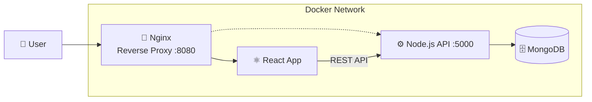

# DevOps Academy — Dockerized MERN Application

Student enrollment platform, fully containerized and production-hardened.

## Stack

- **Frontend:** React (Vite)
- **Backend:** Node.js (Express)
- **Database:** MongoDB
- **Reverse Proxy:** Nginx
- **Containers:** Docker (multi-stage builds) · Docker Compose

## Quick Start

```bash
git clone <this-repo>
cd devops-academy-MERN
./setup.sh
```

Prints the app URL and admin credentials when done.

## Architecture



- 3 containers: **frontend**, **backend**, **mongodb**
- Nginx serves the React build and fronts the stack
- MongoDB has no host-exposed port — reachable only from the backend

## Project Workflow

<p align="center"></p>
<p align="center"><b>Landing Page</b></p>

<p align="center"></p>
<p align="center"><b>Curriculum Breakdown</b></p>

<p align="center"></p>
<p align="center"><b>Student Login</b></p>

<p align="center"></p>
<p align="center"><b>Student Dashboard</b></p>

<p align="center"></p>
<p align="center"><b>Student Profile</b></p>

<p align="center"></p>
<p align="center"><b>Admin Login</b></p>

<p align="center"></p>
<p align="center"><b>Admin Dashboard</b></p>

## Key Features

- Multi-stage, non-root Docker images with healthchecks
- One-command automated setup (`setup.sh`) — secrets auto-generated
- Bcrypt-hashed admin auth in MongoDB (not plaintext)
- Email-based admin password reset (time-limited code)
- Nginx security headers + SPA routing

## Project Structure

```
.
├── setup.sh
├── docker-compose.yml
├── backend/
│   ├── Dockerfile
│   ├── models/Admin.js
│   └── seedAdmin.js
└── frontend/
    ├── Dockerfile
    └── nginx.conf
```

## Roadmap

- CI/CD (GitHub Actions + Jenkins)
- Kubernetes manifests
- Prometheus / Grafana / Loki monitoring

## License

MIT