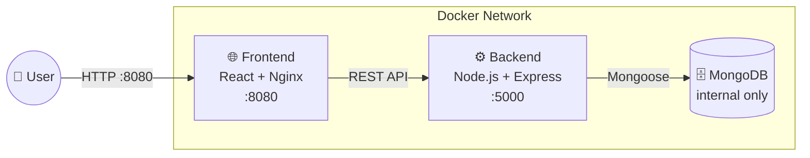
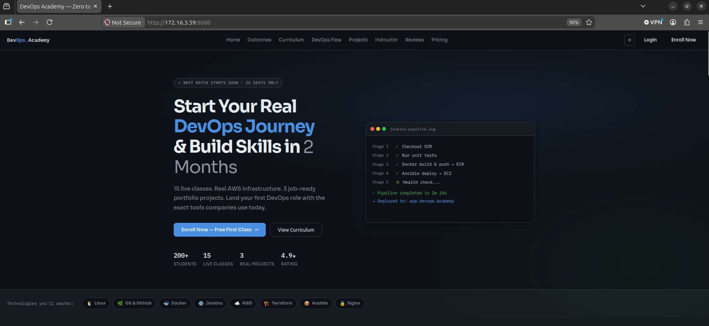
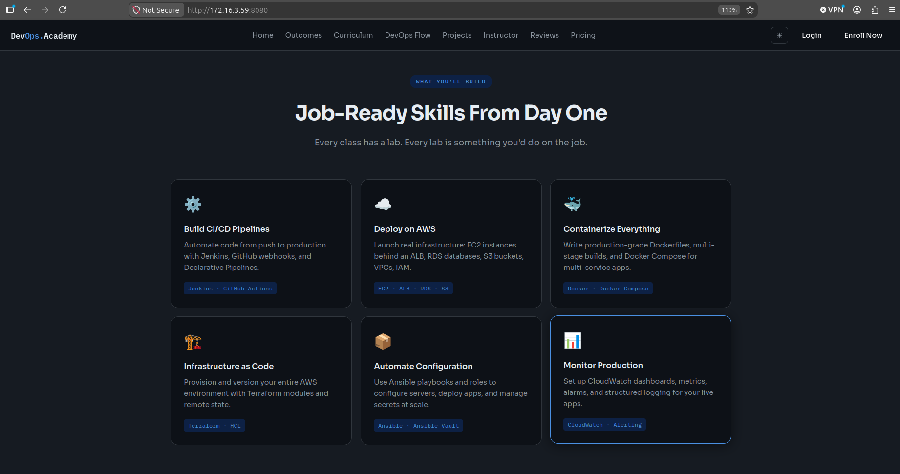
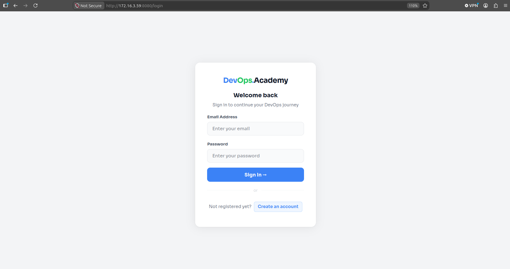
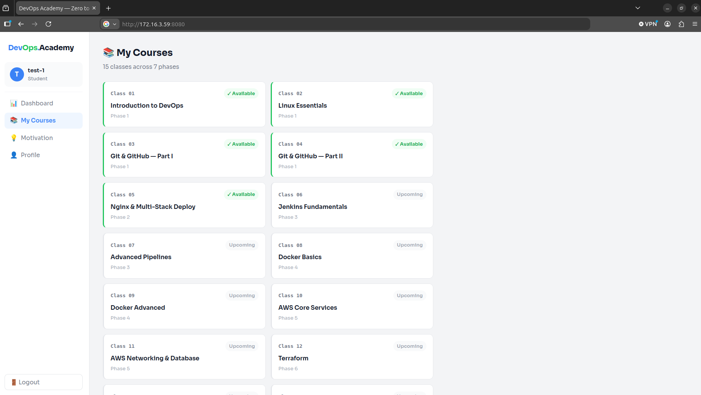
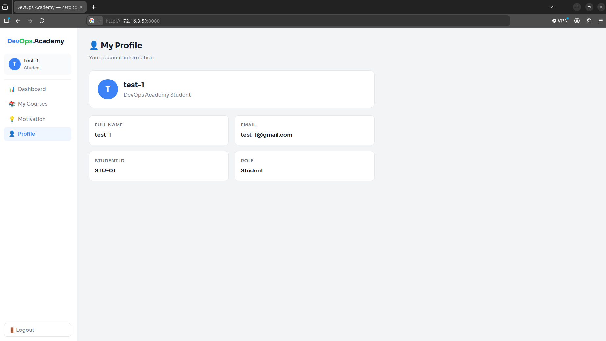
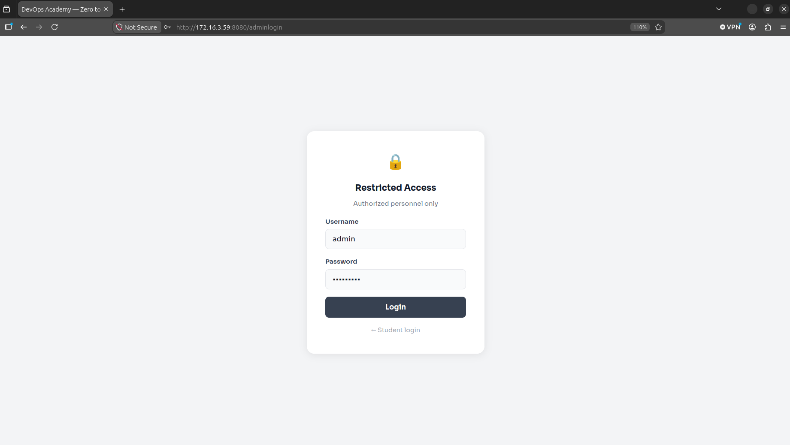
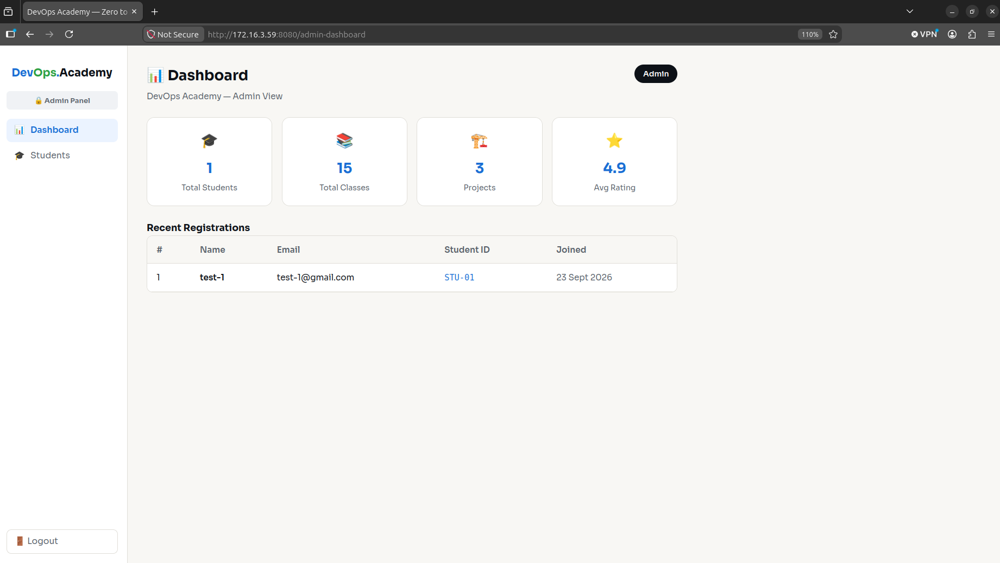

# DevOps Academy — Dockerized MERN Application

A full-stack MERN app (student enrollment platform) containerized and hardened
for production, with a one-command automated setup — built to demonstrate
practical DevOps engineering, not just "it runs in Docker."

## Stack

**App:** React (Vite) · Node.js/Express · MongoDB
**Infra:** Docker (multi-stage builds) · Docker Compose · Nginx

## Why this isn't just `docker run` and a prayer

- **Multi-stage, non-root Docker images** for both services — final images carry no build tools, dev dependencies, or root-owned processes. Both ship a container-level `HEALTHCHECK` hitting the app's own health/readiness endpoints.
- **One-command bootstrap** (`./setup.sh`) — clone the repo, run one script, and it detects your server IP, generates every secret (Mongo credentials, JWT secret, admin password) with `openssl`, writes both `.env` files, patches the frontend's API URL to match your environment, builds, starts, health-checks, and seeds the admin account. No manual `.env` copying, no hardcoded IPs.
- **Real authentication security** — admin credentials live in MongoDB as bcrypt hashes, not plaintext in a config file. Includes a genuine self-service password-reset flow: a time-limited, hashed 6-digit code emailed to the account's registered address, not a fake "contact support" placeholder.
- **Fails loud, not silent** — the setup script checks for port conflicts and missing config *before* touching Docker, rather than letting a build run for a minute and fail on a cryptic error. Malformed or missing environment variables stop the process immediately instead of silently defaulting to blank.
- **Static frontend served by Nginx**, not Node — smaller image, correct SPA fallback routing, cache headers on hashed assets, and security headers (`X-Frame-Options`, `X-Content-Type-Options`) out of the box.

## Quick start

```bash
git clone <this-repo>
cd devops-academy-MERN
./setup.sh
```

That's it — the script prints the running app URL and admin credentials when it finishes.

## Architecture



Three containers, one Docker network. Only the frontend and backend ports are exposed to the host — MongoDB is reachable only from the backend, never directly from outside.

## Project workflow

| | |
|---|---|
|  | **Landing page** — course overview, stats, tech stack |
|  | **Curriculum breakdown** — CI/CD, AWS, Docker, IaC, monitoring modules |
|  | **Student auth** — JWT-based login/register |
|  | **Student dashboard** — enrolled classes, phase progress |
|  | **Student profile** — account details |
|  | **Admin auth** — separate restricted login, bcrypt-hashed, DB-backed |
|  | **Admin dashboard** — live student registrations, stats |

## Project structure

```
.
├── setup.sh              # one-command automated bootstrap
├── docker-compose.yml    # orchestrates all three services
├── backend/
│   ├── Dockerfile         # multi-stage, non-root, healthchecked
│   ├── models/Admin.js    # hashed credentials + reset-code fields
│   └── seedAdmin.js       # creates/updates the admin account
└── frontend/
    ├── Dockerfile          # Vite build → Nginx serve
    └── nginx.conf          # SPA routing + security headers
```

## What's next

- CI/CD pipeline (GitHub Actions + Jenkins) for automated build/scan/deploy
- Kubernetes manifests for multi-node orchestration
- Prometheus/Grafana/Loki observability stack

## License

MIT