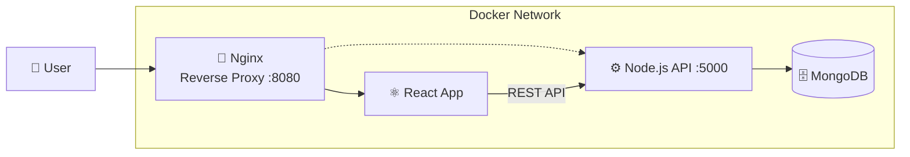
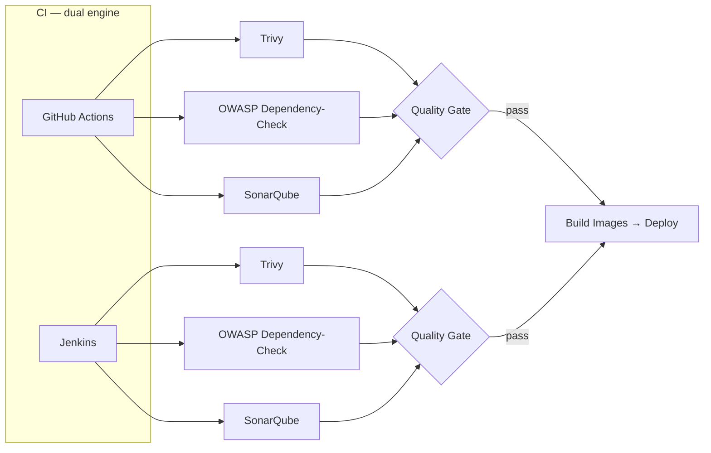
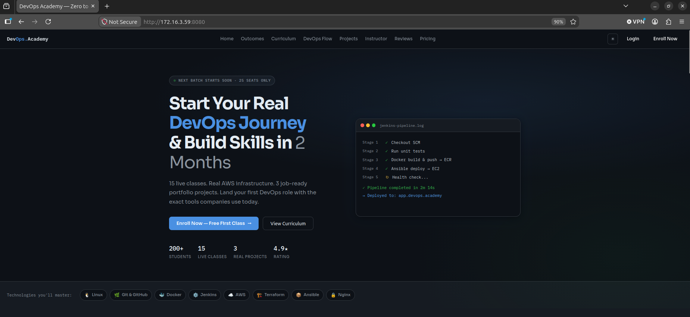
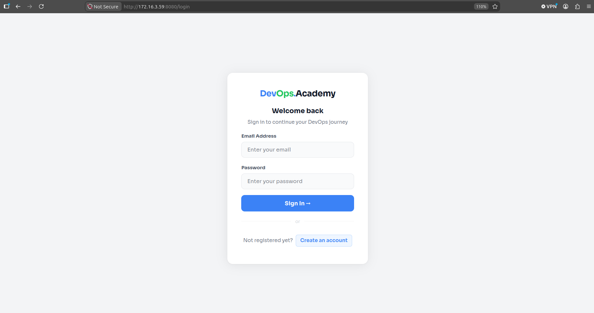
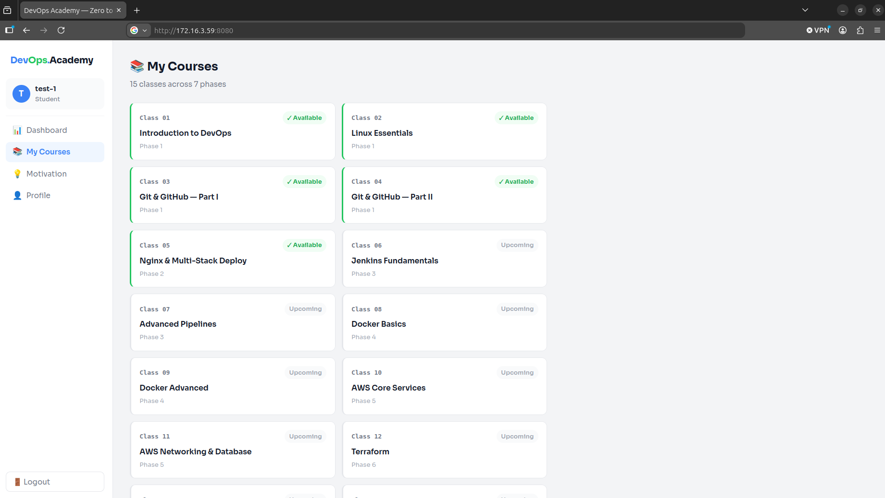
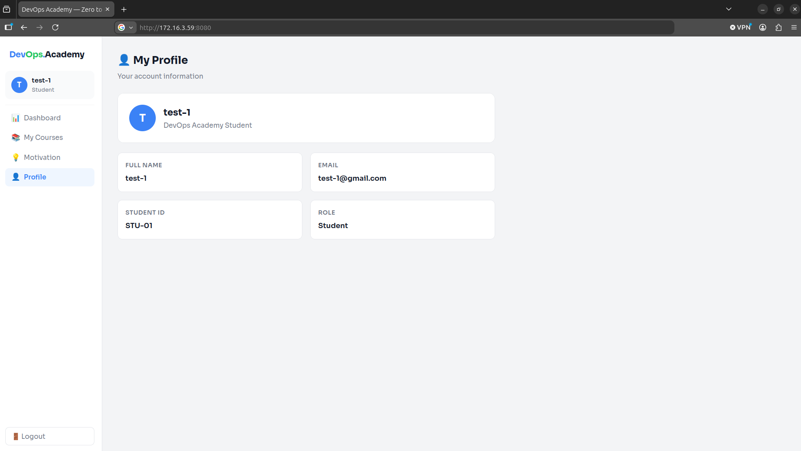
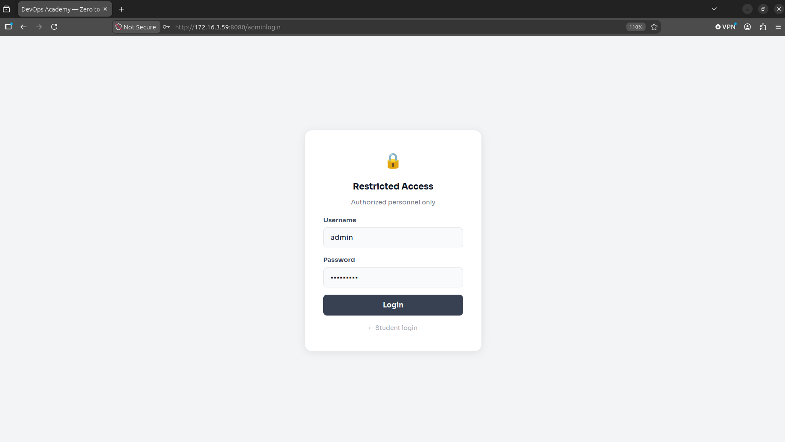
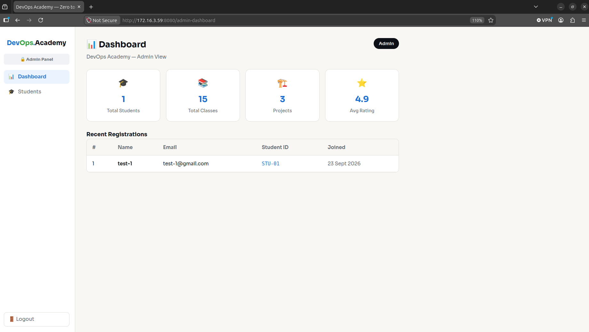

# DevOps Academy — Dockerized MERN Application

Student enrollment platform, fully containerized, DevSecOps-hardened, with dual CI/CD (GitHub Actions + Jenkins) enforcing security gates before every deploy.

## Stack

- **Frontend:** React (Vite)
- **Backend:** Node.js (Express)
- **Database:** MongoDB
- **Reverse Proxy:** Nginx
- **Containers:** Docker (multi-stage builds) · Docker Compose
- **CI/CD:** GitHub Actions · Jenkins
- **Security:** Trivy · OWASP Dependency-Check · SonarQube

## Quick Start

```bash
git clone <this-repo>
cd devops-academy-MERN
./setup.sh
```

## Architecture


```mermaid
flowchart LR
    U[👤 User] --> N[🔀 Nginx<br/>Reverse Proxy :8080]
    N --> FE[⚛️ React App]
    N -.-> BE[⚙️ Node.js API :5000]
    FE -->|REST API| BE
    BE --> DB[(🗄️ MongoDB)]

    subgraph Docker Network
    N
    FE
    BE
    DB
    end
```

- 3 containers: **frontend**, **backend**, **mongodb**
- Nginx serves the React build and fronts the stack
- MongoDB has no host-exposed port — reachable only from the backend

## DevSecOps Pipeline


```mermaid
flowchart LR
    subgraph CI["CI — dual engine"]
        GHA[GitHub Actions]
        JEN[Jenkins]
    end

    GHA --> T1[Trivy]
    GHA --> O1[OWASP Dependency-Check]
    GHA --> S1[SonarQube]
    JEN --> T2[Trivy]
    JEN --> O2[OWASP Dependency-Check]
    JEN --> S2[SonarQube]

    T1 & O1 & S1 --> QG1{Quality Gate}
    T2 & O2 & S2 --> QG2{Quality Gate}

    QG1 -->|pass| DEPLOY[Build Images → Deploy]
    QG2 -->|pass| DEPLOY
```

| Gate | Tool | Enforcement |
|---|---|---|
| Vulnerability scan (filesystem/deps) | **Trivy** | Blocks on CRITICAL/HIGH |
| Dependency CVE audit | **OWASP Dependency-Check** | NVD-backed, CVSS ≥ 7 |
| Static code analysis | **SonarQube** | Quality Gate must pass |
| Deploy | Docker Compose | Only runs after all gates pass |

### GitHub Actions — Security Scan → Deploy

<p align="center"></p>
<p align="center"><b>GitHub Actions — Trivy → OWASP → SonarQube → Deploy (workflow_run trigger)</b></p>

### Jenkins — Same Gates, Same Server

<p align="center"></p>
<p align="center"><b>Jenkins Pipeline — Trivy → OWASP → SonarQube → Quality Gate → Build → Deploy</b></p>

### SonarQube Quality Gate — Real Analysis

<p align="center"></p>
<p align="center"><b>Self-hosted SonarQube — 4.1k LOC analyzed, Quality Gate Passed</b></p>

## Project Workflow

<p align="center"></p>
<p align="center"><b>Landing Page</b></p>

<p align="center"></p>
<p align="center"><b>Student Login</b></p>

<p align="center"></p>
<p align="center"><b>Student Dashboard</b></p>

<p align="center"></p>
<p align="center"><b>Student Profile</b></p>

<p align="center"></p>
<p align="center"><b>Admin Login</b></p>

<p align="center"></p>
<p align="center"><b>Admin Dashboard</b></p>

## Key Features

- Multi-stage, non-root Docker images with healthchecks
- One-command automated setup (`setup.sh`) — secrets auto-generated
- Bcrypt-hashed admin auth in MongoDB (not plaintext)
- Email-based admin password reset (time-limited code)
- Nginx security headers + SPA routing
- Dual CI/CD engines, both gated by Trivy + OWASP + SonarQube
- Self-hosted SonarQube — no third-party code exposure

## Project Structure

```
.
├── setup.sh
├── docker-compose.yml
├── Jenkinsfile
├── .github/workflows/
│   ├── security.yml
│   └── deploy.yml
├── backend/
│   ├── Dockerfile
│   ├── models/Admin.js
│   └── seedAdmin.js
└── frontend/
    ├── Dockerfile
    └── nginx.conf
```

## Roadmap

- Kubernetes manifests
- Prometheus / Grafana / Loki monitoring
- ArgoCD GitOps

## License

MIT