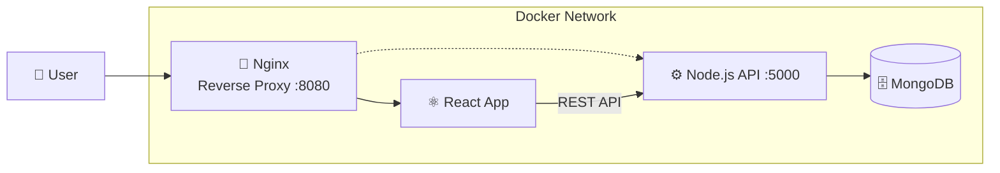
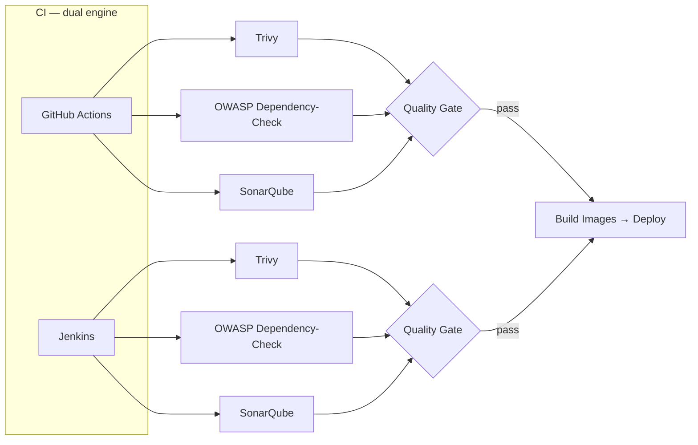

# DevOps Academy — Dockerized MERN Application

Student enrollment platform, fully containerized, DevSecOps-hardened, deployed on a self-managed Kubernetes platform with GitOps-driven continuous delivery.

## Table of Contents

- [Stack](#stack)
- [Quick Start](#quick-start)
- [Architecture](#architecture)
- [DevSecOps Pipeline (GitHub Actions + Jenkins)](#devsecops-pipeline)
- [Nginx Hardening](#nginx-hardening)
- [Kubernetes Platform](#kubernetes-platform)
  - [Cluster & Networking](#cluster--networking)
  - [TLS — cert-manager + Let's Encrypt](#tls--cert-manager--lets-encrypt)
  - [Helm Packaging](#helm-packaging)
  - [Security — RBAC & NetworkPolicy](#security--rbac--networkpolicy)
  - [GitOps — ArgoCD](#gitops--argocd)
- [Observability (In Progress)](#observability-in-progress)
- [Project Structure](#project-structure)
- [Roadmap](#roadmap)
- [License](#license)

## Stack

- **Frontend:** React (Vite)
- **Backend:** Node.js (Express)
- **Database:** MongoDB
- **Reverse Proxy:** Nginx
- **Containers:** Docker (multi-stage builds) · Docker Compose
- **CI/CD:** GitHub Actions · Jenkins · ArgoCD (GitOps)
- **Security:** Trivy · OWASP Dependency-Check · SonarQube
- **Orchestration:** Kubernetes (RKE2) · Helm · Calico · cert-manager
- **Registry:** GitHub Container Registry (GHCR)

## Quick Start

```bash
git clone <this-repo>
cd devops-academy-MERN
./setup.sh
```

## Architecture


```mermaid
flowchart LR
    U[👤 User] --> N[🔀 Nginx<br/>Reverse Proxy :8080]
    N --> FE[⚛️ React App]
    N -.-> BE[⚙️ Node.js API :5000]
    FE -->|REST API| BE
    BE --> DB[(🗄️ MongoDB)]

    subgraph Docker Network
    N
    FE
    BE
    DB
    end
```

- 3 containers: **frontend**, **backend**, **mongodb**
- Nginx serves the React build and fronts the stack
- MongoDB has no host-exposed port — reachable only from the backend

## DevSecOps Pipeline


```mermaid
flowchart LR
    subgraph CI["CI — dual engine"]
        GHA[GitHub Actions]
        JEN[Jenkins]
    end

    GHA --> T1[Trivy]
    GHA --> O1[OWASP Dependency-Check]
    GHA --> S1[SonarQube]
    JEN --> T2[Trivy]
    JEN --> O2[OWASP Dependency-Check]
    JEN --> S2[SonarQube]

    T1 & O1 & S1 --> QG1{Quality Gate}
    T2 & O2 & S2 --> QG2{Quality Gate}

    QG1 -->|pass| DEPLOY[Build Images → Deploy]
    QG2 -->|pass| DEPLOY
```

| Gate | Tool | Enforcement |
|---|---|---|
| Vulnerability scan (filesystem/deps) | **Trivy** | Blocks on CRITICAL/HIGH |
| Dependency CVE audit | **OWASP Dependency-Check** | NVD-backed, CVSS ≥ 7 |
| Static code analysis | **SonarQube** | Quality Gate must pass |
| Deploy | Docker Compose / ArgoCD | Only runs after all gates pass |

- Dual CI/CD engines (GitHub Actions + Jenkins), independently gated by the same three tools
- Self-hosted SonarQube — no third-party code exposure
- GHCR used as the container registry for the Kubernetes deployment path

<p align="center"></p>
<p align="center"><b>GitHub Actions — Trivy → OWASP → SonarQube → Deploy</b></p>

<p align="center"></p>
<p align="center"><b>Jenkins — Same Gates, Same Server</b></p>

<p align="center"></p>
<p align="center"><b>Self-hosted SonarQube — Quality Gate Passed</b></p>

## Nginx Hardening

- Gzip compression (text/css/js/json/svg)
- Security headers: `X-Content-Type-Options`, `X-Frame-Options`, `Referrer-Policy`, `Permissions-Policy`
- `server_tokens off` — version hidden from response headers
- Hidden-file blocking (`location ~ /\.`) — `.env`, `.git`, etc. return `403`
- Exact-match healthcheck (`location = /healthz`)
- Immutable caching (30d) on static assets
- Non-root container user with correct pid-file ownership
- SPA fallback (`try_files`) for client-side routing

## Kubernetes Platform

Deployed on a dedicated, self-managed RKE2 cluster (separate from the CI/CD host), reachable at a real domain with a trusted TLS certificate, deployed via GitOps.

### Cluster & Networking

- **RKE2** (Rancher Kubernetes Engine 2) — CIS-hardened distribution, single-node control plane
- **Calico** CNI (bundled as Canal) — the default distro was chosen specifically because it enforces `NetworkPolicy`, unlike lighter alternatives
- **Traefik** — bundled Ingress controller, path-based routing (`/api` → backend, `/` → frontend) behind a single entry point
- Dedicated Elastic IP + custom domain (`app.sadiqdev.online`) via Spaceship DNS
- `local-path-provisioner` — dynamic PersistentVolume provisioning for stateful workloads

<p align="center"></p>
<p align="center"><b>Cluster node and application workloads — Ready / Running</b></p>

### TLS — cert-manager + Let's Encrypt

- `cert-manager` installed with a `ClusterIssuer` targeting Let's Encrypt's production ACME endpoint
- HTTP-01 challenge automated through the existing Ingress — no manual certificate handling
- Auto-renewing, trusted certificate — no self-signed warnings

<p align="center"></p>
<p align="center"><b>Trusted Let's Encrypt certificate — app.sadiqdev.online</b></p>

### Helm Packaging

- Full application (Namespace, ConfigMap, Secret, MongoDB StatefulSet, backend/frontend Deployments, Ingress, HPA, RBAC, NetworkPolicy) converted into a single versioned Helm chart
- Parameterized `values.yaml` — image tags, replica counts, resource limits, domain, all configurable without touching templates
- Secrets excluded from version control by design — real values supplied only at install/sync time

<p align="center"></p>
<p align="center"><b>Helm release — deployed and tracked</b></p>

### Security — RBAC & NetworkPolicy

- Dedicated `ServiceAccount` per workload, bound to a least-privilege `Role` (read-only on ConfigMaps/Secrets) — replacing the implicit `default` service account
- Default-deny `NetworkPolicy` applied cluster-namespace-wide, with explicit allow rules layered on top:
  - Ingress controller → frontend/backend only
  - Backend → MongoDB only, on port 27017
  - **MongoDB is unreachable from the frontend pod entirely** — verified directly, not assumed
- Non-root containers throughout, explicit numeric UID, dropped Linux capabilities, no privilege escalation

<p align="center"></p>
<p align="center"><b>NetworkPolicies applied — default-deny plus explicit allow rules</b></p>

### GitOps — ArgoCD

- Application deployment fully decoupled from manual `kubectl`/`helm` commands
- ArgoCD continuously reconciles the live cluster state against the Helm chart in this repository
- Auto-sync, self-heal, and automatic pruning enabled — a manual change to the cluster is automatically reverted to match git; the desired state always lives in version control
- Deploying a change is now: commit → push → ArgoCD applies it automatically

<p align="center"></p>
<p align="center"><b>ArgoCD — application synced from this repository</b></p>

<p align="center"></p>
<p align="center"><b>Full resource tree — every object tracked and health-checked by ArgoCD</b></p>

## Observability (In Progress)

Architecture designed and partially provisioned; full rollout in progress.

- **Prometheus** + **Grafana** + **Loki**, run on a dedicated, separate monitoring host — deliberately kept off the application cluster to avoid resource contention on a constrained node
- **node_exporter** running natively on the Kubernetes host for node-level metrics
- **Promtail** planned as an in-cluster DaemonSet to ship pod logs to Loki
- Grafana data sources (Prometheus + Loki) provisioned as code, not configured manually through the UI

## Project Structure

```
.
├── setup.sh
├── docker-compose.yml
├── Jenkinsfile
├── argocd-app.yaml
├── .github/workflows/
│   ├── security.yml
│   ├── deploy.yml
│   └── ghcr-build.yml
├── backend/
│   ├── Dockerfile
│   ├── models/Admin.js
│   └── seedAdmin.js
├── frontend/
│   ├── Dockerfile
│   └── nginx.conf
├── k8s/                     # raw manifests (early phase / reference)
├── helm/devops-academy/     # Helm chart — source of truth for the cluster
└── monitoring-server/       # Prometheus / Grafana / Loki (separate host)
```

## Roadmap

- Complete Promtail log shipping + Grafana dashboards
- Multi-environment namespaces (dev/staging/prod) via Helm values
- Horizontal Pod Autoscaler load-test demonstration
- Pod/node failure and recovery testing

## License

MIT
