# DevOps Academy: Dockerized MERN Application

Student enrollment platform, containerized, DevSecOps hardened, deployed on a self-managed Kubernetes platform with GitOps continuous delivery.

> **Note:** `app.sadiqdev.online` is a test domain used for demonstration purposes only.

## Table of Contents
 
<table align="center">
<tr><td>
[Stack](#stack)<br>
[Quick Start](#quick-start)<br>
[Architecture](#architecture)<br>
[DevSecOps Pipeline (GitHub Actions + Jenkins)](#devsecops-pipeline)<br>
[Nginx Hardening](#nginx-hardening)<br>
[Kubernetes Platform](#kubernetes-platform)<br>
&nbsp;&nbsp;&nbsp;↳ [Cluster & Networking](#cluster--networking)<br>
&nbsp;&nbsp;&nbsp;↳ [TLS (cert-manager + Let's Encrypt)](#tls)<br>
&nbsp;&nbsp;&nbsp;↳ [Helm Packaging](#helm-packaging)<br>
&nbsp;&nbsp;&nbsp;↳ [Security (RBAC & NetworkPolicy)](#security)<br>
&nbsp;&nbsp;&nbsp;↳ [GitOps (ArgoCD)](#gitops)<br>
[Observability (In Progress)](#observability-in-progress)<br>
[Project Structure](#project-structure)<br>
[Roadmap](#roadmap)<br>
[License](#license)
 
</td></tr>
</table>


## Stack

- Frontend: React (Vite)
- Backend: Node.js (Express)
- Database: MongoDB
- Reverse Proxy: Nginx
- Containers: Docker (multi-stage) · Docker Compose
- CI/CD: GitHub Actions · Jenkins · ArgoCD
- Security: Trivy · OWASP Dependency-Check · SonarQube
- Orchestration: Kubernetes (RKE2) · Helm · Calico · cert-manager
- Registry: GitHub Container Registry (GHCR)

## Quick Start

```bash
git clone <this-repo>
cd devops-academy-MERN
./setup.sh
```

## Architecture

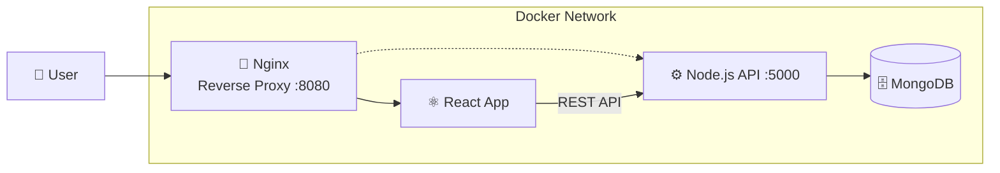
```mermaid
flowchart LR
    U[👤 User] --> N[🔀 Nginx<br/>Reverse Proxy :8080]
    N --> FE[⚛️ React App]
    N -.-> BE[⚙️ Node.js API :5000]
    FE -->|REST API| BE
    BE --> DB[(🗄️ MongoDB)]

    subgraph Docker Network
    N
    FE
    BE
    DB
    end
```

- 3 containers: frontend, backend, mongodb
- Nginx serves the React build and fronts the stack
- MongoDB has no host-exposed port

## DevSecOps Pipeline

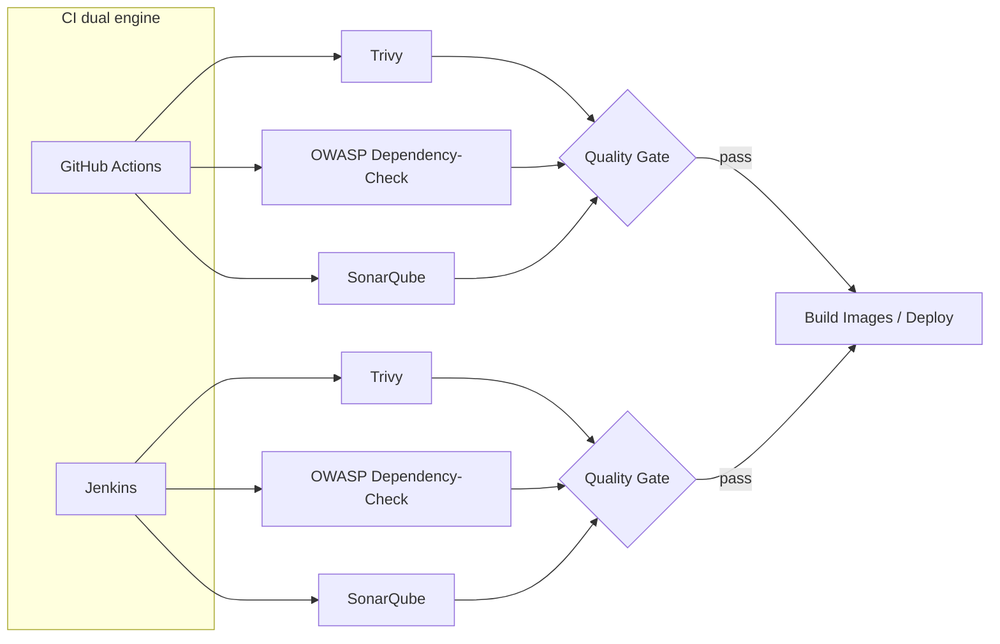
```mermaid
flowchart LR
    subgraph CI["CI dual engine"]
        GHA[GitHub Actions]
        JEN[Jenkins]
    end

    GHA --> T1[Trivy]
    GHA --> O1[OWASP Dependency-Check]
    GHA --> S1[SonarQube]
    JEN --> T2[Trivy]
    JEN --> O2[OWASP Dependency-Check]
    JEN --> S2[SonarQube]

    T1 & O1 & S1 --> QG1{Quality Gate}
    T2 & O2 & S2 --> QG2{Quality Gate}

    QG1 -->|pass| DEPLOY[Build Images / Deploy]
    QG2 -->|pass| DEPLOY
```

| Gate | Tool | Enforcement |
|---|---|---|
| Vulnerability scan | Trivy | Blocks on CRITICAL/HIGH |
| Dependency CVE audit | OWASP Dependency-Check | NVD-backed, CVSS ≥ 7 |
| Static analysis | SonarQube | Quality Gate required |
| Deploy | Docker Compose / ArgoCD | Gated on scan pass |

- Dual CI/CD engines, same three gates on each
- Self-hosted SonarQube, no third-party code exposure
- GHCR used as the registry for the Kubernetes deployment path

<p align="center">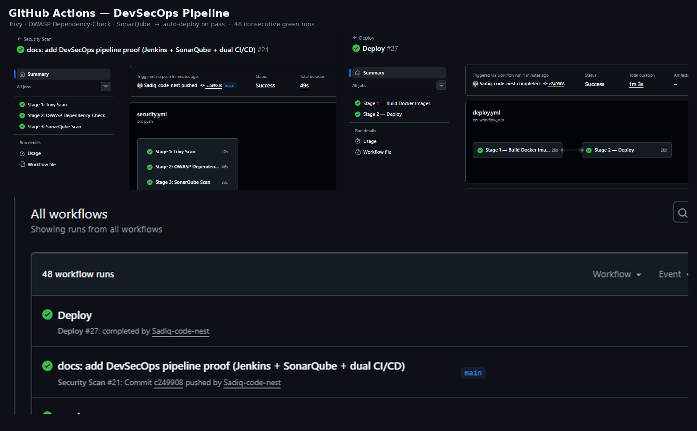</p>
<p align="center"><b>GitHub Actions: Trivy, OWASP, SonarQube, Deploy</b></p>

<p align="center">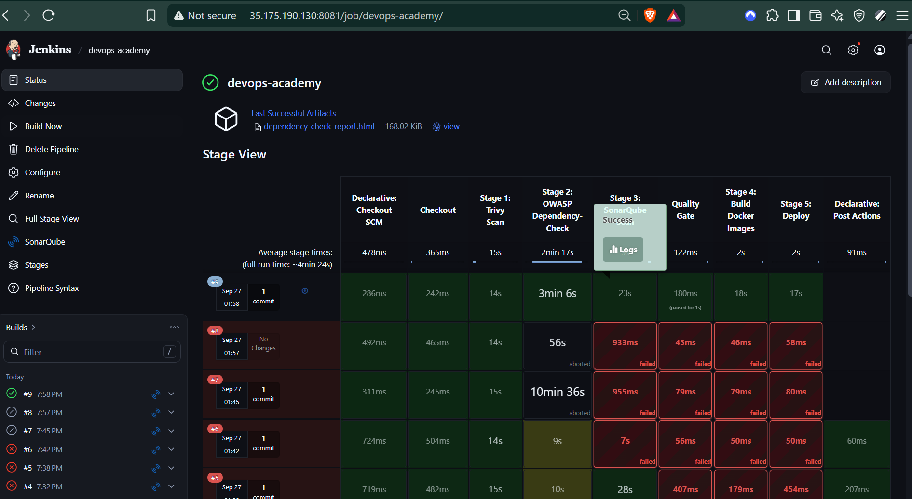</p>
<p align="center"><b>Jenkins: same gates, same server</b></p>

<p align="center">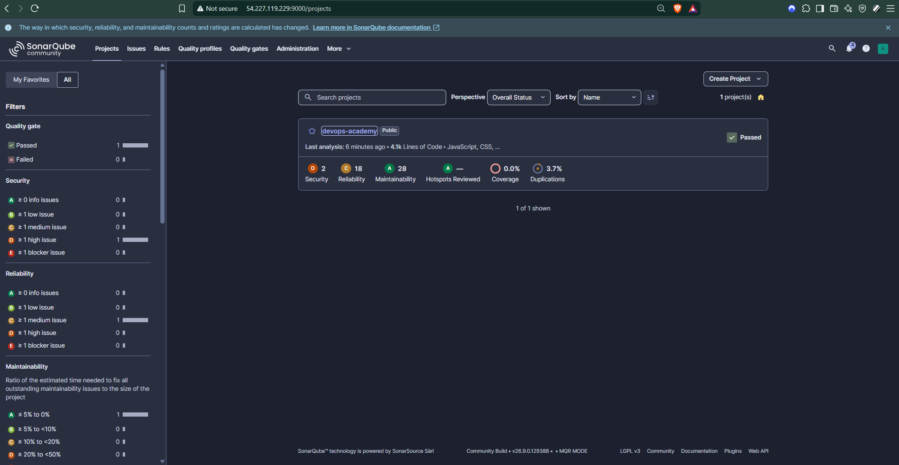</p>
<p align="center"><b>Self-hosted SonarQube, Quality Gate passed</b></p>

## Nginx Hardening

- Gzip compression
- Security headers: `X-Content-Type-Options`, `X-Frame-Options`, `Referrer-Policy`, `Permissions-Policy`
- `server_tokens off`
- Hidden-file blocking (`.env`, `.git` return `403`)
- Exact-match healthcheck
- Immutable caching on static assets
- Non-root container, correct pid-file ownership
- SPA fallback routing

## Kubernetes Platform

Self-managed RKE2 cluster on a dedicated host, real domain, trusted TLS, GitOps deployment.

### Cluster & Networking

- RKE2, CIS-hardened distribution, single-node control plane
- Calico CNI (Canal), chosen for real NetworkPolicy enforcement
- Traefik Ingress, path-based routing (`/api`, `/`) behind one entry point
- Dedicated Elastic IP, custom domain via Spaceship DNS
- `local-path-provisioner` for dynamic PersistentVolumes

<p align="center">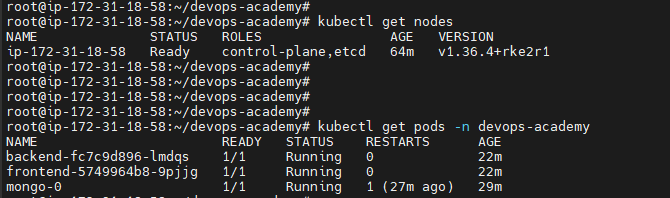</p>
<p align="center"><b>Cluster node and workloads, Ready/Running</b></p>

### TLS

- `cert-manager` with a `ClusterIssuer` on Let's Encrypt production
- HTTP-01 challenge automated through the existing Ingress
- Auto-renewing, trusted certificate

<p align="center">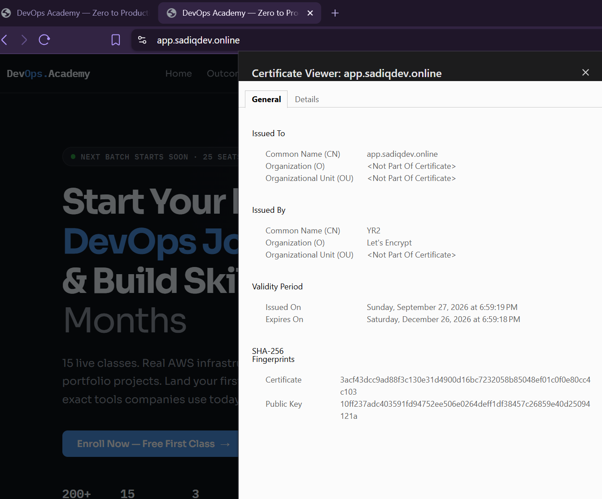</p>
<p align="center"><b>Trusted Let's Encrypt certificate</b></p>

### Helm Packaging

- Full application packaged as one versioned Helm chart
- Parameterized `values.yaml`: image tags, replicas, resource limits, domain
- Secrets excluded from version control by design

<p align="center">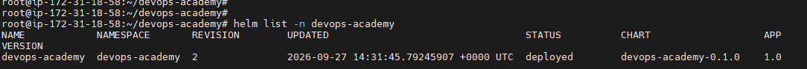</p>
<p align="center"><b>Helm release, deployed</b></p>

### Security

- Dedicated ServiceAccount per workload, bound to a least-privilege Role
- Default-deny NetworkPolicy, explicit allow rules on top:
  - Ingress to frontend/backend only
  - Backend to MongoDB only, port 27017
  - MongoDB unreachable from frontend, verified directly
- Non-root containers, explicit numeric UID, dropped capabilities

<p align="center">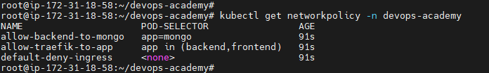</p>
<p align="center"><b>NetworkPolicies applied</b></p>

### GitOps

- Deployment fully decoupled from manual `kubectl`/`helm` commands
- ArgoCD reconciles live cluster state against the Helm chart in this repo
- Auto-sync, self-heal, and pruning enabled
- Deploy flow: commit, push, ArgoCD applies automatically

<p align="center">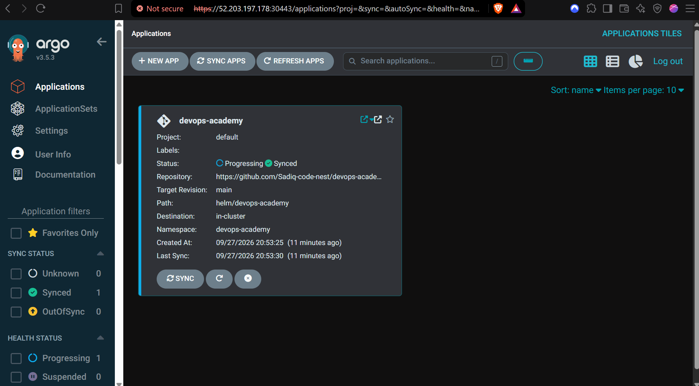</p>
<p align="center"><b>ArgoCD, application synced from this repository</b></p>

<p align="center">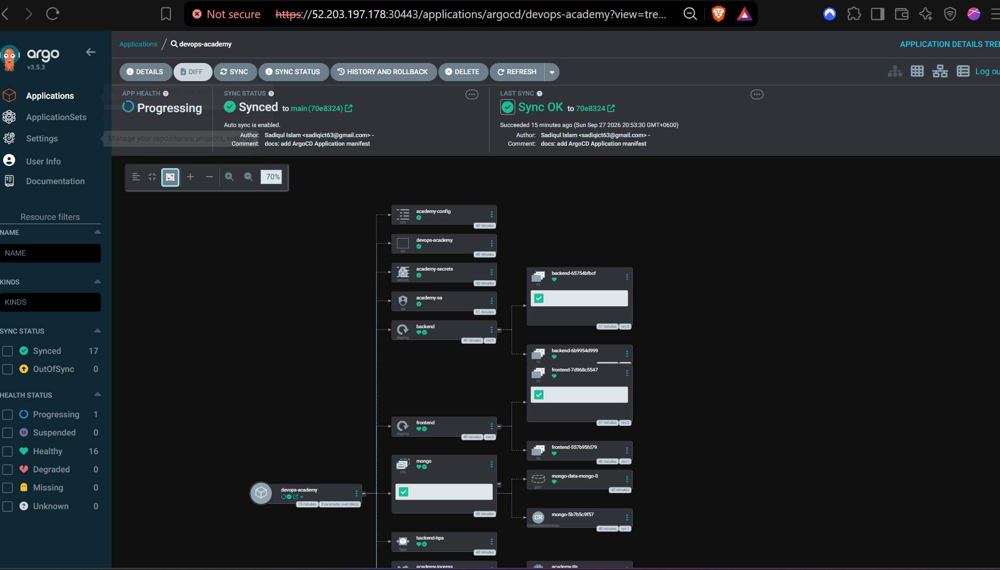</p>
<p align="center"><b>Full resource tree, tracked and health-checked</b></p>

## Observability (In Progress)

Architecture designed, partially provisioned.

- Prometheus, Grafana, Loki on a dedicated, separate monitoring host
- node_exporter running natively on the Kubernetes host
- Promtail planned as an in-cluster DaemonSet for log shipping
- Grafana data sources provisioned as code

## Project Structure

```
.
├── setup.sh
├── docker-compose.yml
├── Jenkinsfile
├── argocd-app.yaml
├── .github/workflows/
│   ├── security.yml
│   ├── deploy.yml
│   └── ghcr-build.yml
├── backend/
│   ├── Dockerfile
│   ├── models/Admin.js
│   └── seedAdmin.js
├── frontend/
│   ├── Dockerfile
│   └── nginx.conf
├── k8s/
├── helm/devops-academy/
└── monitoring-server/
```

## Roadmap

- Complete Promtail log shipping and Grafana dashboards
- Multi-environment namespaces via Helm values
- HPA load-test demonstration
- Pod/node failure and recovery testing

## License

MIT
