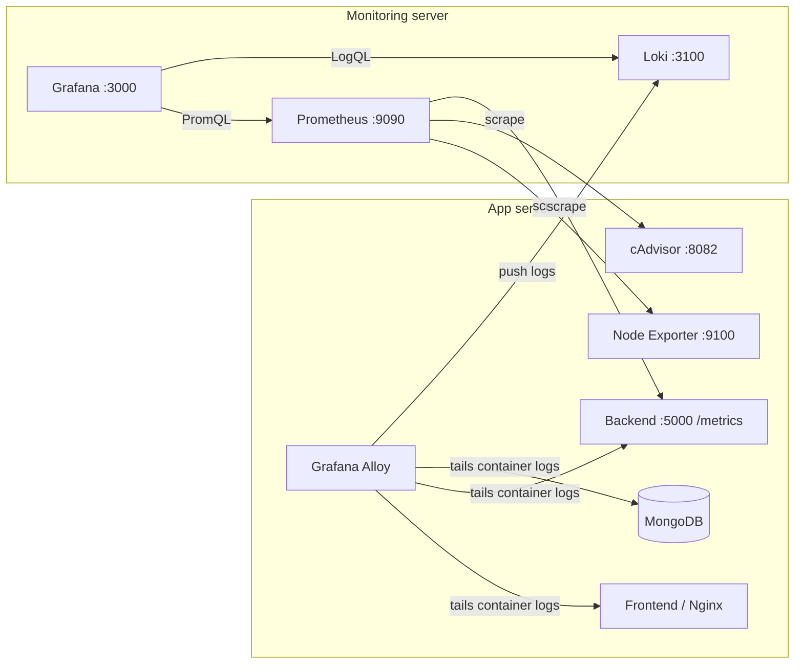
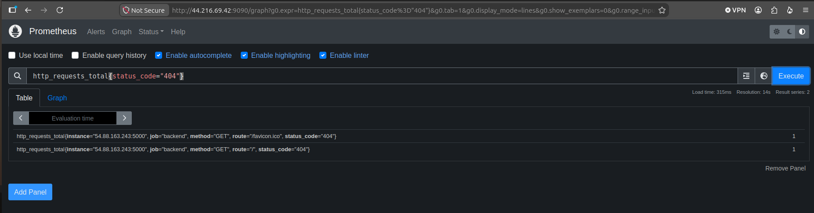
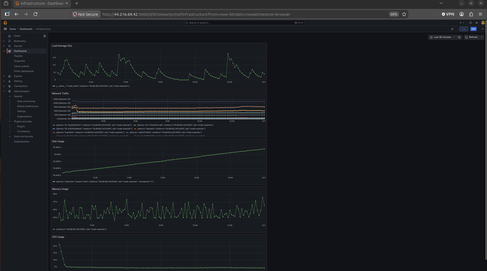
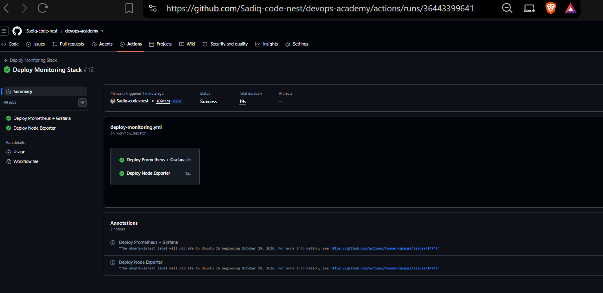

# Observability

Monitoring and centralized logging for the DevOps Academy app. Everything is **configuration as code**, deployed by GitHub Actions, with **no hardcoded IPs or secrets**.

**Status:** metrics, dashboards and logging are done. Upcoming work is in [ROADMAP.md](ROADMAP.md).

## Architecture

Collectors run on the **app server**; storage and dashboards run on a separate **monitoring server**, so monitoring survives an app-server failure.



- **Metrics are pulled** by Prometheus every 15 s. **Logs are pushed** by Alloy to Loki.
- Grafana is the single pane of glass, with Prometheus and Loki provisioned as data sources.

## Components

| Component | Version | Runs on | Purpose |
|---|---|---|---|
| Prometheus | v2.55.1 | Monitoring server | Metrics storage, 15-day retention |
| Grafana | 11.3.0 | Monitoring server | Dashboards |
| Loki | 3.3.2 | Monitoring server | Log storage, 15-day retention |
| Node Exporter | v1.8.2 | App server | Host metrics |
| cAdvisor | v0.52.1 | App server | Per-container metrics |
| Grafana Alloy | v1.5.1 | App server | Log collection |
| prom-client | ^15.1.3 | Backend app | Application metrics |

## What was built

| Phase | What | Proof |
|---|---|---|
| 1. Host metrics | Node Exporter scraped by Prometheus | Targets page below |
| 2. Container metrics | cAdvisor, queried by `image` label | cAdvisor page below |
| 3. App metrics | `/metrics` endpoint: request count and latency per route | 404 query below |
| 4. Dashboards | Infrastructure, Docker Containers, Application, Node Exporter Full | Dashboard screenshots |
| 5. Logging | Alloy ships container logs to Loki | Logs dashboard and Explore |

### Metrics (Phases 1-3)


*All four targets UP.*


*cAdvisor detecting every container on the app server.*


*Failure test: requesting a missing route increments `http_requests_total{status_code="404"}`.*

### Dashboards (Phase 4)


*Node Exporter Full (Grafana Labs #1860), provisioned from git.*


*Infrastructure dashboard (first version, before the network panel was narrowed to the physical interface).*


*Application dashboard: total requests, p95 latency, average duration, request rate per route.*

### Logging (Phase 5)


*Logs dashboard: volume per container, error count, live backend and frontend logs.*


*Backend logs in Grafana Explore: `{container="devops-academy-backend-1"}`.*

Useful LogQL:

```text
{container="devops-academy-backend-1"}
{host="app-server"} |~ "(?i)(error|exception|fatal)"
sum by (container) (count_over_time({host="app-server"}[5m]))
```

## Key design choices

- **Separate monitoring server**, so monitoring survives the failure it detects.
- **Query containers by `image`**, not name: with cAdvisor on containerd the name is a raw ID that changes every redeploy.
- **Low-cardinality labels**: the `route` label uses the matched pattern (`/api/enroll/:id`), and Loki labels are only `container`, `service`, `host`.
- **No hardcoded IPs**: `prometheus.yml` is generated at deploy time from a template and a GitHub Secret.
- **Fixed UIDs** on data sources so dashboards survive a rebuild.

## CI/CD

`deploy-monitoring.yml` deploys over SSH: Prometheus, Loki and Grafana to the monitoring server; Node Exporter, cAdvisor and Alloy to the app server. It runs only on changes under `observability/**`, and the app workflows ignore that folder, so a monitoring change never redeploys the app.


*Green deploy run (job names shown are from an earlier version of the workflow).*

## Problems found and fixed

| Problem | Cause | Fix |
|---|---|---|
| Prometheus kept the old config after deploy | A single-file bind mount pins the file's inode; regenerating the file creates a new one | Mount the directory, force-recreate on deploy |
| cAdvisor couldn't identify containers | Docker's containerd image store and cgroup v2 aren't handled by its legacy discovery | Newer cAdvisor, containerd socket, `moby` namespace, host cgroup |
| Per-container results depended on start order | Docker and containerd discovery paths raced | Removed the Docker socket so containerd is the only path |
| Monitoring pushes redeployed the app | Workflow triggers cascaded | `paths-ignore` on the observability folder |
| Dashboards vanished after renaming `monitoring/` to `observability/` | Compose names volumes after the folder | Copied the data across and pinned `name:` in every compose file |
| SonarQube crash-looped | Root disk over 90%: Elasticsearch blocked shard allocation | Resized the EBS volume and extended the filesystem online |

## Known limitations

- The Infrastructure, Docker Containers and Application dashboards were built in the UI and are not in git yet. Only Node Exporter Full and Logs are provisioned from code.
- Per-container **network and filesystem** metrics aren't available in this cAdvisor setup (host-level covers them); CPU, memory and uptime are per container.
- Metrics and Loki endpoints are unauthenticated and rely on Security Group scoping.
- cAdvisor runs `privileged` and Alloy as root to read the Docker socket.
- Alloy collects only the app server's containers, and the backend still logs plain text.
